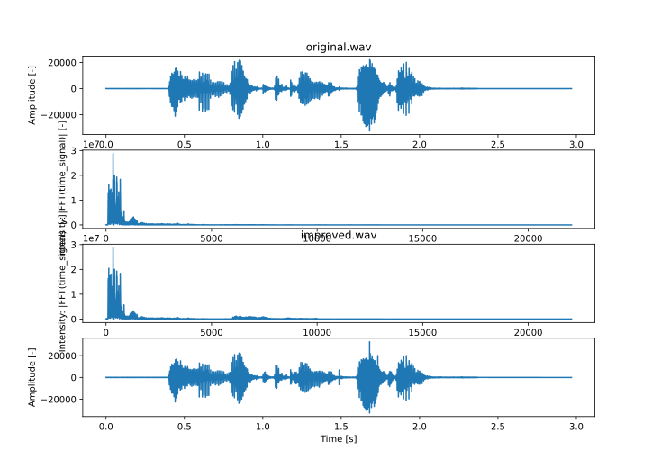

# Assignment 1: Fourier Transform 
### Digital Signal Processing
#### Allan Omar Hernandez Cotto & Szymon Gula

#### Introduction 
This report is outcome of the Digital Signal Processing Assignment 1 about Fourier Transform using Python.

#### Part 1

##### Record the voice of one member of your group as uncompressed WAV. Say one complete sentence. It can be any language. Make sure that you record at least at 44kHz or at a higher sampling rate and that the audio is not clipping. The full audio spectrum up to 20 kHz needs to be available. Low quality MP3 downloads from websites are not allowed. Reports based on recordings at sampling rates below 44kHz or downloads will not be marked.

Using the GarageBand software and external microphone we have recorded the ```"Remember to drink water"``` sentence. 
To ensure sufficient voice quality, we used the ```44.1 kHz``` sampling rate and ```16 bits per sample``` WAVE encoding.

#### Part 2
##### Load the audio samples into python and plot the audio signal in the time domain (linear axis) and in the frequency domain (logarithmic axis for both frequency and amplitude) with proper axis labels (time,frequency, amplitude, dB).

To load the WAVE file we used the ```scipy.io.wavfile``` package, that returns the signal sample rate and array of signal values from decoded file.
In the *figure 1A* we presented the decoded audio signal in the time domain, in the *figure 1B* we show the signal in the frequency domain. 
The frequency domain of the signal was found by Fast Fourier Transform (FFT), and for presentation purpose we calculated absolute value on the FFT output.


__Fig. 1__: Plot A - recorded signal in time domain, 
Plot B - recorded signal in frequency domain, 
Plot C - modified frequency domain to improve listener perception of the voice, 
Plot D - reconstructed time signal from modified frequency spectrum
#### Part 3
#### Explain which peaks in the spectrum correspond to the fundamentals of the vowels spoken. Explain which frequency range mainly contains the consonants.

#### Part 4
#### Improve the quality of your voice by increasing the amplitudes of the base of your voice and the region around 6 − 10 kHz by using the Fast Fourier Transform: transform the time domain signal into the frequency domain, then manipulate the spectrum and then transform it back to the time domain. Make sure that the audio is not clipping or distorted. Save the resulting time domain signal as a WAV (16 bit) and include it in your submission.

For the recorded signal, we found that the region between ```<85 Hz, 250 Hz>``` corresponds to the base frequencies of recorded signal.
To increase amplitude for mentioned region, we decided to multiply FFT output for corresponding frequencies by ```1.25```. Secondly, the region in range ```<6000 Hz, 10000 Hz>``` was multiplied by ```10.0```.

The frequency spectrum achieved in such a way (visualized in *figure 1C*) was used to generate new time signal with improved user voice perception. 
To achieve it the we use Inverted Fourier Transform function. The final time signal is presented in the *figure 1D*.
  
 #### Part 5
#### We have dialled numbers on a touch tone telephone and uploaded the files to moodle. There are different files depending on your matric number and class. Make sure you download the right one. Your task is to use the Fourier Transform to determine which numbers have been dialled. The Python program should be written in a way that it can detect all numbers automatically and prints them on the screen. For that purpose write

  #### (a) a python function which detects one digit from a chunk of the recording and then
  
  #### (b) write the main program as a loop which detects the key presses and then feeds them into the python function in 5a).
 
Given the msc_matric_3.dat file we have loaded the time-series data to decode telephone number. To decode digits, we have implemented the single digit recognition based on the time-sequence. Then, we implemented constant-size window iterator (generate consecutive chunks of same size from series) and for each subsequence we decoded a digit. 

As a result, we achieved following phone number: ```0013-104-558-858```
 
