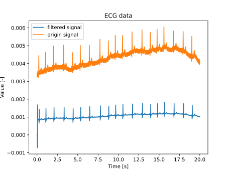
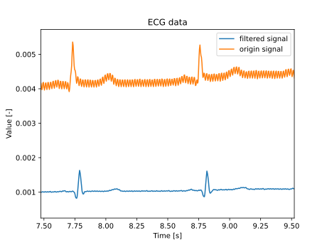
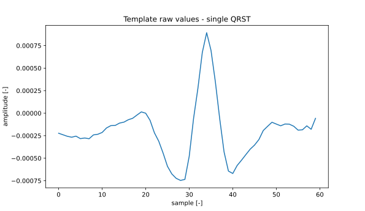
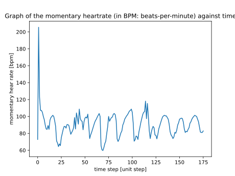
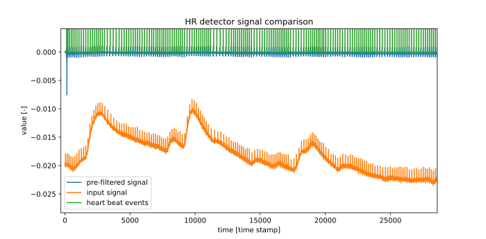
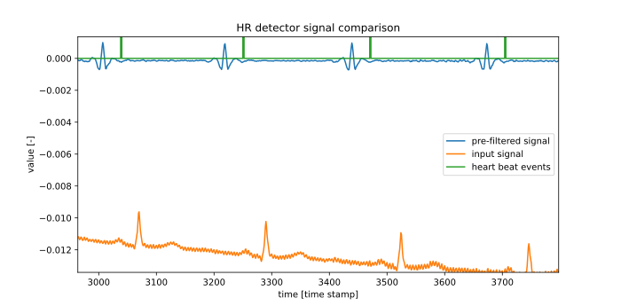

# Assignment 2, Digital Signal processing: FIR filters

### By:
#### Szymon Gula (2601553G)
#### Allan Hernandez (2589702H)


## 1 ECG filtering
### Ex 1
The goal of this exercise was to implement Python FIR filter class.
To realize the task, we decided to use following implementation structure:

    class FIRFilter:
        def __init__(self, impulse_response_coef: np.array) -> None:
            """
            FIR filter setup method, that converts class into function like (callable) object
            :param impulse_response_coef: FIR filter coefficients
            """
    
        def __call__(self, new_val: float) -> float:
            """
            Filter object executable method
            :param new_val: new input value
            :return: filtered output (delayed compared to input)
            """
    
        def do_filter(self):
            """
            Filter execution for given past states and filter coefficients
            :return: single step filtered output
            """
Mentioned design was selected because:
 - class design allows code reusability and easy access from other python modules
 - the call method was used due to "functional" character of the task
 - allows class inheritance for higher level classes
 
 To provide the 'queue' like data structure we used the ```deque``` class from ```collections```. It is high optimized python data structure that supports fixed buffer size and ``` append ``` functionality.
 
 
### Ex 2
 
To ensure the code minimum functionality we added testing component. Inside, we have created two basic unittests.
 
 
    class TestFIR(unittest.TestCase):
        """
        Testing area
        """
        def test_initialization(self):
            """
            Smoke unit test.
            Checks if the initialization and inheritance do not break
            """
    
        def test_fir_base_class(self):
            """ 
            Test FIR responce to the impulse - for predefined coefficents.
            """
    
 The test are executed when the file is executed as the main script.
 
### Ex 3
  
According to Szymon's university number we have selected following data file: ```ECG_msc_matric_3.dat ```.
  
To remove the DC and 50Hz noise we designed the FIR factory that extends ```FIRFilter``` class and calculates the FIR filter coefficients.
The ```FIRFilterFactory```, except number of tabs in filer, it takes the frequency range to remove, and window type. 
  
    class FIRFilterFactory(FIRFilter):
        def __init__(self, num_taps: int, norm_freq_list: list, pass_zero: bool, window_type: 'str' = 'triangle') -> None:
            """
            FIR filter designed (based on the FIRFilter class)
            :param num_taps: number of tabs in the FIR filter
            :param norm_freq_list: list of frequencies to remove
            :param pass_zero: flag if first given frequency is passed or removed
            :param window_type: filter window type
            """
    
        def _initialize_impulse_response(self) -> np.array:
            """
            Based on the defined cutoff frequency - design the FIR filter coefficients
            :return: raw filter coefficients
            """
    
        def _initialize_window(self) -> np.array:
            """
            Initialized the window coefficients for given window type
            :return: window coefficients
            """

For this exercise we initialize FIR filter with 30 taps, cutoff frequency at ~<0, 10>Hz and ~<40, 60>Hz.
The first region corresponds to DC removal and later for the 50Hz removal. In addition, to get better performance, we apply triangle window to the FIR coefficients.

The data processing is done in pseudo real time manner:

    ######   INITIALIZATION   ###### 
    fr = 250
    freq = [x / fr for x in [0, 10, 40, 60]]    # normalized frequency
    my_fir = FIRFilterFactory(30, freq)
    output_list = np.zeros(len(ecg_vals))
    
    ######   DATA HANDLING   ###### 
    for idx, val in enumerate(ecg_vals):
        output_list[idx] = my_fir(val)

Using mentioned code we achieved following results:



__Fig. 1__: ECG full data: before and after filtering using FIR filter



__Fig. 2__: Zoomed Fig. 1; it can be seen that the PQRST is intacted, and noise was (mostly) removed.

## 2 ECG heartrate detection

### Ex 1
In this exercise we developed a matched filter by using QRST template to detect the R-peaks.

From the technical perspective, we have created two classes to realize the QRST detector, namely: ```FIRDetector``` and ```HeartbeatsDetector```.

The base class, the ```FIRDetector``` is a general implementation of the template detector based on the matched FIR filter. 

    class FIRDetector(FIRFilter):
        def __init__(self, values, threshold_value):
            """
            Factory for the FIR detector using templates
            :param values: the templates coefficients
            :param threshold_value: event detector threshold (for squared convolution)
            """
    
        def __call__(self, *args, **kwargs):
            """
            Execute template convolution with historical signal;
            This method also ensures that signal is triggered at maximum once per len(template) inputs
            :param args: inherited
            :param kwargs: inherited
            :return: event signal (1 - if template detected, 0 - otherwise)
            """
            out = super().__call__(*args, **kwargs)  # Execute FIR filter with template coefficients 
            out **= 2
            out = int(out > self.threshold_value)
            if out and self.since_last_peak > self._num_of_taps:        # Check to generate impulse at most once per template size
                self.since_last_peak = -1
            else:
                out = 0
            self.since_last_peak += 1
            return out
            
The later class: ```HeartbeatsDetector``` is a class that inherit from ```FIRDetector``` and applies hardcoded heartbeats template. In addition it calculates the momentary and average heart-rate.

    class HeartbeatsDetector(FIRDetector):
        def __init__(self, fs=250):
            """
            Heart beats template based on the FIRDetector class
            It uses predefined/hardcoded heart beat shape as the template base
            :param fs: sampling frequency (to calculate time between beats)
            """
            
        def __call__(self, *args, **kwargs):
            """
            Extends FIRDetector callable functionality with heart beat postprocessing
            :param args: inherited
            :param kwargs: inherited
            :return: inherited
            """
            samples_since_last_peak = self.since_last_peak
            heartbeat_detected = super().__call__(*args, **kwargs)      # flag if heartbeat detected
            if heartbeat_detected:                                      # calculate BPM and log data
                self.heart_rate = 60 * self.fs / samples_since_last_peak
                self.heart_rate_history.append(self.heart_rate)
                self.average_heart_rate = np.mean(self.heart_rate_history)
            return out
    
        def get_heart_rate(self):
            """interface """

To initialize the matched filter we used example QRST signal manually found in provided data (presented in Fig. 3).



__Fig. 3__: Single QRST time series - used as a raw signal for the matched filter (used by ```HeartbeatsDetector``` class)


### Ex 2

For this exercise we used the ```GUDb/walking/13/Einthoven_II``` data-set (according to the last digit in Szymon's student number). The data was used to verify our implementation of the Ex 2.1 on real-world data. 

The data processing is realize in pseudo real time manner. 

    ecg_class = GUDb(13,  'walking')                      # agregate data
    my_fir = FIRFilterFactory(300, freq, False)           # prefilter (DC and 50Hz noise removal) 
    my_detector = HeartbeatsDetector()                    # heart beat detector

    for idx, val in enumerate(ecg_class.einthoven_II):    # pseudo real time data generator
        output_list[idx] = my_fir(val)                    # prefilter
        output_piks[idx] = my_detector(output_list[idx])  # detect heart beats
        if output_piks[idx] > 0:                          # if heart beats detected
            hr, ahr = my_detector.get_heart_rate()        # agrete temporal and average BPM
            heart_rate.append(hr)                          # log data


The crucial steps are: 
- prefiltering - where DC and other noise artefacts are removed.
- template matched detecting - where the event detection is handled.

Also, it is worth noted how we handle 'false events' removal. We have realized, that all false events (after initial filter stabilization) are due to multiple detection of the same R-peak. To overcome this problem, we implemented limitation on the matched filter to trigger event at most once per ```len(filter_taps)``` time steps.


####Results:

In the Fig. 4 it can be seen the momentary heart rate. At the early time steps, the measurement is not accurate due to filter initialization inertia.



__Fig. 4__: Momentary heartrate in BPM



__Fig. 5__: ECG and heart-detector data



__Fig. 6__: ECG and heart-detector data (zoomed)


## Appendix

### ecg_filter.py

    import numpy as np
    import matplotlib.pyplot as plt
    from fir_filter import FIRFilterFactory, FIRFilter
    
    
    def test_full_flow():
        """ Full flow smoke test"""
        with open(r'ECG_msc_matric_3.dat', 'r') as file:
            ecg_vals = []
            for val in file.readlines():
                ecg_vals.append(float(val))
        fr = 250
        freq = [x / fr for x in [0, 10, 40, 60]]
        my_fir = FIRFilterFactory(30, freq, False)
    
        output_list = np.zeros(len(ecg_vals))
        for idx, val in enumerate(ecg_vals):
            output_list[idx] = my_fir(val)
    
        time_s = np.array(range(len(output_list))) / fr
        plt.plot(time_s, output_list, label='filtered signal')
        plt.plot(time_s, ecg_vals, label='origin signal')
        plt.xlabel('Time [s]')
        plt.ylabel('Value [-]')
        plt.title('ECG data')
        plt.legend()
        plt.show()
        #plt.savefig('ECG_data.svg')
    
    
    if __name__ == '__main__':
        test_full_flow()

### fir_filter.py

    from collections import deque
    import numpy as np
    import unittest


    class FIRFilter:
        def __init__(self, impulse_response_coef: np.array) -> None:
            """
            FIR filter setup method, that converts class into function like (callable) object
            :param impulse_response_coef: FIR filter coefficients
            """
            self._num_of_taps = len(impulse_response_coef)
            self._past_values = deque([0] * self._num_of_taps, maxlen=self._num_of_taps)
            self._impulse_response = impulse_response_coef
    
        def __call__(self, new_val: float) -> float:
            """
            Filter object executable method
            :param new_val: new input value
            :return: filtered output (delayed compared to input)
            """
            self._past_values.append(new_val)
            return self.do_filter()
    
        def do_filter(self):
            """
            Filter execution for given past states and filter coefficients
            :return: single step filtered output
            """
            return np.sum(np.multiply(self._past_values, self._impulse_response))
    
    
    class FIRFilterFactory(FIRFilter):
        def __init__(self, num_taps: int, norm_freq_list: list, pass_zero: bool, window_type: 'str' = 'triangle') -> None:
            """
            FIR filter designed (based on the FIRFilter class)
            :param num_taps: number of tabs in the FIR filter
            :param norm_freq_list: list of frequencies to remove
            :param pass_zero: flag if first given frequency is passed or removed
            :param window_type: filter window type
            """
            self._num_of_taps = num_taps
            self._freq_list = np.array(norm_freq_list)
            self._pass_zero = pass_zero
            self._window_type = window_type
    
            self._impulse_response = self._initialize_impulse_response()
            self._window = self._initialize_window()
            super().__init__(self._impulse_response * self._window)
    
        def _initialize_impulse_response(self) -> np.array:
            """
            Based on the defined cutoff frequency - design the FIR filter coefficients
            :return: raw filter coefficients
            """
            ideal_fre_resp = np.ones(self._num_of_taps//2)
            state_toggle = int(not self._pass_zero)
            left_end = 0
            for freq in self._freq_list:
                right_end = int(freq * self._num_of_taps)
                ideal_fre_resp[left_end:right_end+1] = state_toggle
                left_end = right_end
                state_toggle = 1 - state_toggle
    
            ideal_fre_resp = np.array([*ideal_fre_resp, *ideal_fre_resp[::-1]])
            resp_ifft = np.fft.ifft(ideal_fre_resp)
            temp = resp_ifft.copy()
            resp_ifft[len(resp_ifft)//2:], resp_ifft[:len(resp_ifft)//2] = temp[:len(resp_ifft)//2], temp[len(resp_ifft)//2:]
            return resp_ifft
    
        def _initialize_window(self) -> np.array:
            """
            Initialized the window coefficients for given window type
            :return: window coefficients
            """
            if self._window_type == 'triangle':
                norm_range = np.arange(0, 1, 1 / (self._num_of_taps // 2))
                norm_range = np.array([*norm_range, *norm_range[::-1]])
            else:
                raise NotImplemented('Currently only triangle method is implemented - please use it')
            return norm_range
    
    
    class FIRDetector(FIRFilter):
        def __init__(self, values, threshold_value=2.5e-11):
            """
            Factory for the FIR detector using templates
            :param values: the templates coefficients
            :param threshold_value: event detector threshold (for squared convolution)
            """
            self.threshold_value = threshold_value
            super().__init__(values)
            self.since_last_peak = self._num_of_taps
            self._debug = []
    
        def __call__(self, *args, **kwargs):
            """
            Execute template convolution with historical signal;
            This method also ensures that signal is triggered at maximum once per len(template) inputs
            :param args: inherited
            :param kwargs: inherited
            :return: event signal
            """
            out = super().__call__(*args, **kwargs)
            out **= 2
            self._debug.append(out)
            out = int(out > self.threshold_value)
            if out and self.since_last_peak > self._num_of_taps:
                self.since_last_peak = -1
            else:
                out = 0
            self.since_last_peak += 1
            return out
    
    
    class TestFIR(unittest.TestCase):
        """
        Testing area
        """
        def test_initialization(self):
            """Smoke unit test """
            freq = [x / 250 for x in [40, 60]]
            my_fir = FIRFilterFactory(30, freq, False)
    
        def test_fir_base_class(self):
            """ Test FIR base on the impulse"""
            coef = np.array([0, 0.5, 1, 0.5, 0])
            my_fir = FIRFilter(coef)
            impuls = [1, 0, 0, 0, 0]
            out = [my_fir(i) for i in impuls]
            np.testing.assert_array_almost_equal(coef, out)
    
    
    if __name__ == '__main__':
        unittest.main()
    
### hr_detect.py

    from ecg_gudb_database import GUDb
    import numpy as np
    from collections import deque
    import matplotlib.pyplot as plt
    from fir_filter import FIRDetector, FIRFilterFactory
    
    
    class HeartbeatsDetector(FIRDetector):
        def __init__(self, fs=250):
            """
            Heart beats template based on the FIRDetector class
            It uses predefined/hardcoded heart beat shape as the template base
            :param fs: sampling frequency (to calculate time between beats)
            """
            # single_peak_range = (1170, 1200)
            values = np.array(
                [-2.22810372e-04, -2.39728147e-04, -2.56649948e-04, -2.66944121e-04,
                 -2.55091646e-04, -2.82744064e-04, -2.75640369e-04, -2.83856690e-04,
                 -2.41320108e-04, -2.34271600e-04, -2.14147065e-04, -1.64292148e-04,
                 -1.38330570e-04, -1.36223466e-04, -1.10100576e-04, -9.95941213e-05,
                 -7.31425922e-05, -5.70053840e-05, -2.07566317e-05, 1.41124442e-05,
                 -5.75160332e-07, -7.93870659e-05, -2.17743132e-04, -3.11713559e-04,
                 -4.43628182e-04, -5.89962427e-04, -6.74583967e-04, -7.23436156e-04,
                 -7.46469319e-04, -7.35359383e-04, -4.77638220e-04, -5.65740806e-05,
                 2.78727232e-04, 6.73170119e-04, 8.93254660e-04, 6.97064807e-04,
                 3.47992714e-04, -6.22294667e-05, -4.30642062e-04, -6.42892980e-04,
                 -6.69740291e-04, -5.81140779e-04, -5.22548704e-04, -4.60380262e-04,
                 -3.99605363e-04, -3.54068200e-04, -2.92999105e-04, -1.92964742e-04,
                 -1.45894186e-04, -1.00865863e-04, -1.21077438e-04, -1.40184192e-04,
                 -1.20383251e-04, -1.22370280e-04, -1.45199095e-04, -1.88362713e-04,
                 -1.84759906e-04, -1.40900153e-04, -1.78750993e-04, -5.73116219e-05])
            values = values[::-1]
            self.heart_rate = 0
            self.average_heart_rate = 0
            self.heart_rate_history = deque(maxlen=10)
            self.fs = fs
            super().__init__(values)
    
        def __call__(self, *args, **kwargs):
            """
            Extends FIRDetector callable functionality with heart beat postprocessing
            :param args: inherited
            :param kwargs: inherited
            :return: inherited
            """
            samples_since_last_peak = self.since_last_peak
            heart_beat_detected = super().__call__(*args, **kwargs)
            if heart_beat_detected:
                self.heart_rate = 60 * self.fs / samples_since_last_peak
                self.heart_rate_history.append(self.heart_rate)
                self.average_heart_rate = np.mean(self.heart_rate_history)
            return heart_beat_detected
    
        def get_heart_rate(self):
            """ just interface """
            return self.heart_rate, self.average_heart_rate
    
    
    if __name__ == '__main__':
        ecg_class = GUDb(13,  'walking')
        heart_rate = []
        freq = [x / 250 for x in [0, 10, 40, 60]]
        my_fir = FIRFilterFactory(300, freq, False)
        my_detector = HeartbeatsDetector()
    
        output_list = np.zeros(len(ecg_class.einthoven_II))
        output_piks = np.zeros(len(ecg_class.einthoven_II))
        for idx, val in enumerate(ecg_class.einthoven_II):
            output_list[idx] = my_fir(val)
            output_piks[idx] = my_detector(output_list[idx])
            if output_piks[idx] > 0:
                hr, ahr = my_detector.get_heart_rate()
                heart_rate.append(hr)
                if idx % 20 == 0:
                    print(f' beats per minute (bpm) = {hr:.2f}, \t mean bpm (10 cycles) = {ahr:.2f}')
    
        plt.plot(heart_rate)
        plt.title('Graph of the momentary heartrate (in BPM: beats-per-minute) against time')
        plt.xlabel('time step [unit step]')
        plt.ylabel('momentary hear rate [bpm]')
        plt.show()
        print('end')
